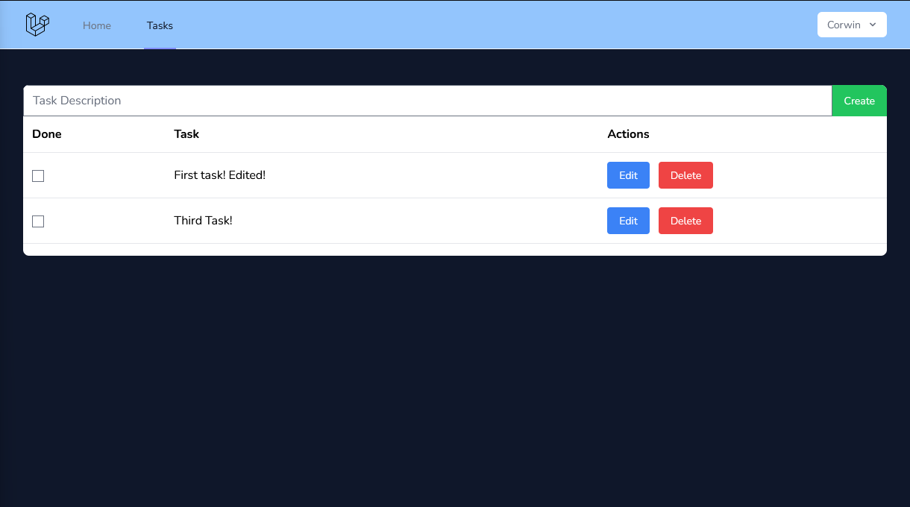

# Task Manager
Task Manager is a small application made to experiment with Laravel + React, and Tailwinds. It is a single page application, and is responsive to the user. It uses AJAX in Javascript in order to run the API.

The backend uses MySQL + Laravel. The front end is using Laravel Breeze + React.

The API is implemented in app/http/controllers/TaskController.php . It uses JSON instead of POST variables to communicate with React. The API is:

* /task GET - Get the logged in users task
* /task POST - Create Task
* /task/{task id} POST - Delete OR Update task, based on JSON.

User authentication is with Inertia. Database is using Eloquent ORM.

NOTE: This is not polished! This is simply me experimenting with Laravel.

## Building

For development: 
Using sail, bring up the services with `sail up -d` and then build the databases with `sail artisan migrate`.